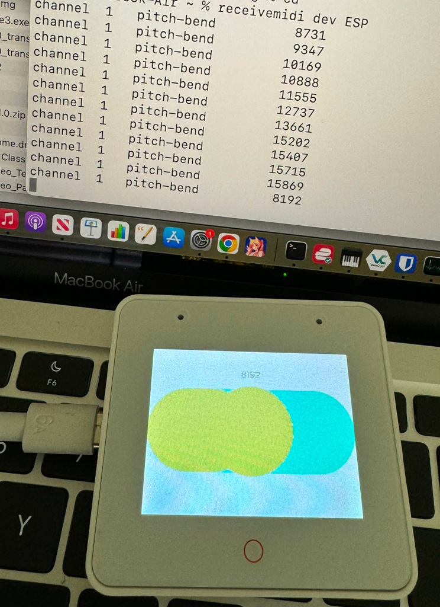
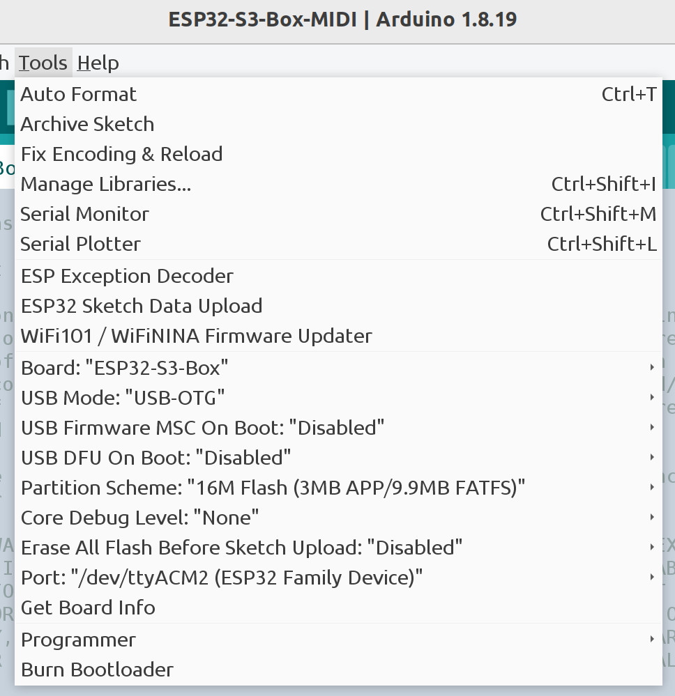

# ESP32-S3 Box MIDI Pitch Bend Slider

The photo shows the ESP32-S3-Box with pitch bend slider connected to a MacBook.
The MacBook is running [receivemidi](https://github.com/gbevin/ReceiveMIDI) to
show the MIDI pitch bend messages. The moire pattern and blue splotches are not
visible to the naked eye. They are most likely caused by interference between
the display and the camera.

Tested using Arduino IDE 1.8.19 and
[Espressif ESP32-BOX-S3-3](https://github.com/espressif/esp-box/blob/master/docs/hardware_overview/esp32_s3_box_3/hardware_overview_for_box_3.md)

This is a simple example of using lvgl to create one slider on the ESP32-S3 Box
display. Moving the slider sends MIDI pitch bend messages over USB. When the
slider is released, the slider springs back to the center position.

## Dependencies

Install the following libraries using the Arduino IDE Library manager.

* "ESP32_IO_Expander" by espressif
* "ESP32_Display_Panel" by espressif
* "lvgl" by kisvegabor,embeddedt,pete-pjb Version 8.4.0

The configuration files are set for ESP32-S3 Box 3 and lvgl version 8.4.0.

## Arduino IDE Build options for ESP32-S3 Box 3

